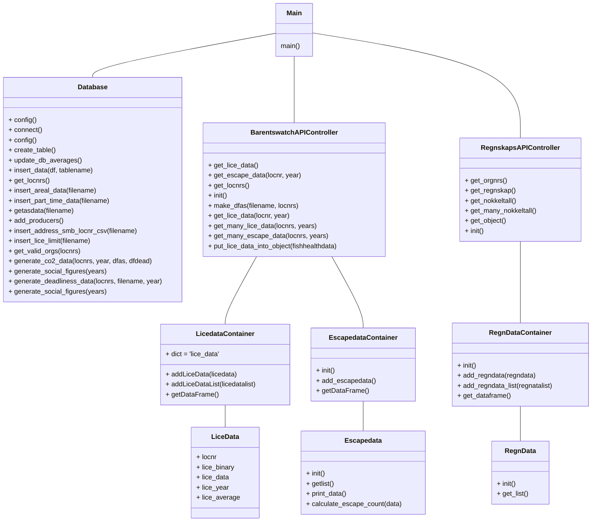

```mermaid
classDiagram

Main -- Database
Main -- BarentswatchAPIController
	BarentswatchAPIController -- LicedataContainer
		LicedataContainer -- LiceData
	BarentswatchAPIController -- EscapedataContainer
		EscapedataContainer -- Escapedata
Main -- RegnskapsAPIController
	RegnskapsAPIController -- RegnDataContainer
		RegnDataContainer -- RegnData
	
	class Main {
          main()
    }

    class BarentswatchAPIController {
      + get_lice_data()
	  + get_escape_data(locnr, year)
	  + get_locnrs()
	  + init()
	  + make_dfas(filename, locnrs)
	  + get_lice_data(locnr, year)
	  + get_many_lice_data(locnrs, years)
	  + get_many_escape_data(locnrs, years)
	  + put_lice_data_into_object(fishhealthdata)
	  
    }

    class RegnskapsAPIController {
      + get_orgnrs()
	  + get_regnskap()
	  + get_nokkeltall()
	  + get_many_nokkeltall()
	  + get_object()
	  + init()
    }


    class Database {
      + config()
	  + connect()
	  + config()
	  + create_table()
	  + update_db_averages()
	  + insert_data(df, tablename)
	  + get_locnrs()
	  + insert_areal_data(filename)
	  + insert_part_time_data(filename)
	  + getasdata(filename)
	  + add_producers()
	  + insert_address_smb_locnr_csv(filename)
	  + insert_lice_limit(filename)
	  + get_valid_orgs(locnrs)
	  + generate_co2_data(locnrs, year, dfas, dfdead)
	  + generate_social_figures(years)
	  + generate_deadliness_data(locnrs, filename, year)
	  + generate_social_figures(years)
	  
    }
	    


	class LicedataContainer {
      + dict = 'lice_data'
	  + addLiceData(licedata)
	  + addLiceDataList(licedatalist)
	  + getDataFrame()
	  
    }

	class LiceData {
      + locnr
	  + lice_binary
	  + lice_data
	  + lice_year
	  + lice_average
	  
    }
	
	class Escapedata {
      + init()
	  + getlist()
	  + print_data()
	  + calculate_escape_count(data)
	  
    }
	class RegnData {
      + init()
	  + get_list()
    }
    
    class RegnDataContainer {
      + init()
	  + add_regndata(regndata)
	  + add_regndata_list(regnatalist)
	  + get_dataframe()
    }
	
	class EscapedataContainer {
      + init()
	  + add_escapedata()
	  + getDataFrame()
	  
    }
	

	
```
