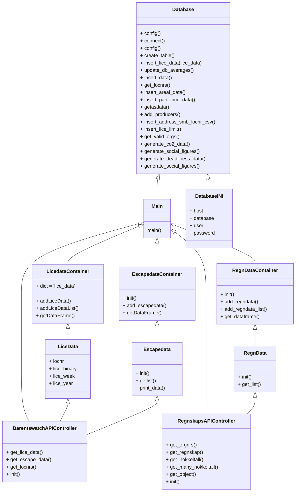

```mermaid
classDiagram

    Main <|-- BarentswatchAPIController
    Main <|-- RegnskapsAPIController
    Main <|-- RegnDataContainer
    RegnDataContainer <|-- RegnData
    Database <|-- Main
	Database <|-- DatabaseINI
	LiceData <|-- BarentswatchAPIController
	Escapedata <|-- BarentswatchAPIController
	Main <|-- LicedataContainer
	LicedataContainer <|-- LiceData
	EscapedataContainer <|-- Escapedata
	Main <|-- EscapedataContainer
	RegnData <|-- RegnskapsAPIController
	
    
	
	class Main {
          main()
    }

    class BarentswatchAPIController {
      + get_lice_data()
	  + get_escape_data()
	  + get_locnrs()
	  + init()
    }

    class RegnskapsAPIController {
      + get_orgnrs()
	  + get_regnskap()
	  + get_nokkeltall()
	  + get_many_nokkeltall()
	  + get_object()
	  + init()
    }


    class Database {
      + config()
	  + connect()
	  + config()
	  + create_table()
	  + insert_lice_data(lice_data)
	  + update_db_averages()
	  + insert_data()
	  + get_locnrs()
	  + insert_areal_data()
	  + insert_part_time_data()
	  + getasdata()
	  + add_producers()
	  + insert_address_smb_locnr_csv()
	  + insert_lice_limit()
	  + get_valid_orgs()
	  + generate_co2_data()
	  + generate_social_figures()
	  + generate_deadliness_data()
	  + generate_social_figures()
	  
    }
	    
	class DatabaseINI {
      + host
	  + database
	  + user
	  + password
      
    }

	class LicedataContainer {
      + dict = 'lice_data'
	  + addLiceData()
	  + addLiceDataList()
	  + getDataFrame()
	  
    }

	class LiceData {
      + locnr
	  + lice_binary
	  + lice_week
	  + lice_year
    }
	
	class Escapedata {
      + init()
	  + getlist()
	  + print_data()
	  
    }
	class RegnData {
      + init()
	  + get_list()
    }
    
    class RegnDataContainer {
      + init()
	  + add_regndata()
	  + add_regndata_list()
	  + get_dataframe()
    }
	
	class EscapedataContainer {
      + init()
	  + add_escapedata()
	  + getDataFrame()
	  
    }
	

	
```
