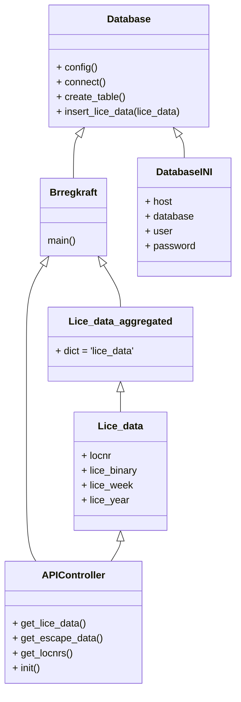

```mermaid
classDiagram

    Brregkraft <|-- APIController
    Database <|-- Brregkraft
	Database <|-- DatabaseINI
	Lice_data <|-- APIController
	Brregkraft <|-- Lice_data_aggregated
	Lice_data_aggregated <|-- Lice_data

    class Brregkraft {
          main()
    }

    class APIController {
      + get_lice_data()
	  + get_escape_data()
	  + get_locnrs()
	  + init()
    }

    class Database {
      + config()
	  + connect()
	  + create_table()
	  + insert_lice_data(lice_data)
    }
	    
	class DatabaseINI {
      + host
	  + database
	  + user
	  + password
      
    }

	class Lice_data_aggregated {
      + dict = 'lice_data'
    }

	class Lice_data {
      + locnr
	  + lice_binary
	  + lice_week
	  + lice_year
    }
	
```